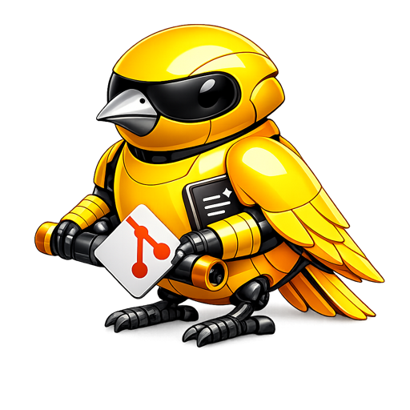

<p align="center">
  
</p>

# GitCanary

A native macOS menu bar app that monitors git repositories and provides AI-generated summaries of changes on remote/origin since last pulled. Early warning about what's coming from remote.

**Your code stays on your machine.** GitCanary is local-first — all git operations happen on your Mac and AI summarization defaults to local providers. Cloud providers are available but opt-in and the privacy implications are clearly communicated.

[](https://ko-fi.com/V7V31T6CL9)

## Features

- **Lightweight remote monitoring** — uses `git ls-remote` (~1-10 KB) to detect new commits without cloning
- **AI-powered summaries** — get concise bullet-point summaries of what changed and why
- **Flexible scheduling** — interval polling, scheduled check times (e.g., 09:00 Mon–Fri), or both
- **Missed schedule catch-up** — if your Mac was off at 09:00, the summary runs when you open the lid and connectivity is established
- **Multiple repositories** — monitor as many repos as you need from one menu bar icon
- **Power-aware** — optionally defer AI summarization when on battery

## AI Providers

| Provider | Type | Notes |
|----------|------|-------|
| **Apple Intelligence** | Local | On-device, macOS 26+, no setup required |
| **Ollama** | Local | Runs on your Mac or any machine on your local network (Raspberry Pi, NAS, homelab) |
| **Claude** | Cloud | Anthropic API, requires API key |
| **OpenAI** | Cloud | OpenAI API, requires API key |

Default priority: Apple Intelligence (if available) → Ollama → Cloud providers.

### Privacy Notice

**Local providers** (Apple Intelligence, Ollama): Your repository data never leaves your trusted environment. Ollama can run on localhost or any host on your local network — either way, your data stays within your own infrastructure.

**Cloud providers** (Claude, OpenAI): Commit messages and diffs are sent to external servers for summarization. Only use these providers if you trust them with your codebase data.

## Installation

### Homebrew (recommended)

```bash
brew tap jordiboehme/tap
brew install --cask gitcanary
```

### Download

Grab the latest DMG from [GitHub Releases](https://github.com/jordiboehme/GitCanary/releases), open it and drag GitCanary to Applications.

### Build from Source

```bash
git clone https://github.com/jordiboehme/GitCanary.git
cd GitCanary
xcodebuild -project GitCanary/GitCanary.xcodeproj -scheme GitCanary -configuration Release build CONFIGURATION_BUILD_DIR=build
```

Then move `build/GitCanary.app` to `/Applications` and launch it.

## Requirements

- **macOS 14 Sonoma** or later
- **Git** (included with Xcode Command Line Tools)
- For Ollama: [Ollama](https://ollama.ai) running locally or on your network
- For Apple Intelligence: macOS 26+ with Apple Intelligence enabled

## License

MIT License — See [LICENSE](LICENSE) for details.
